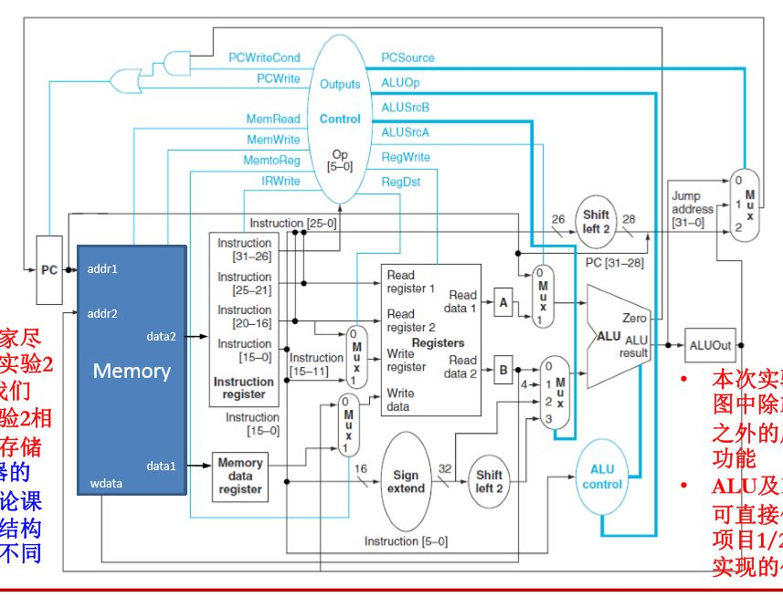
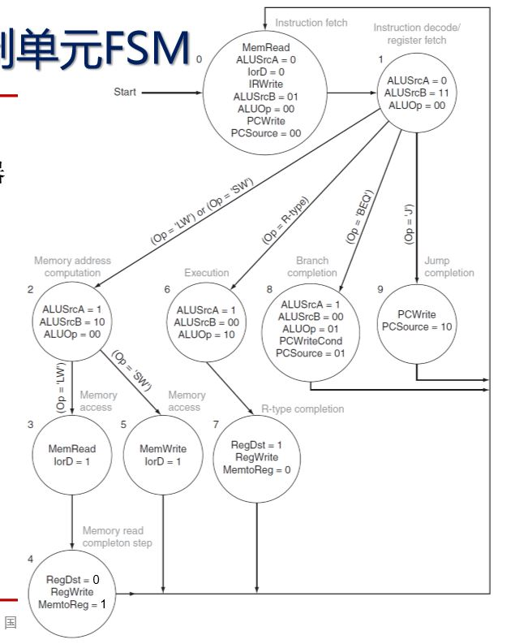

# MIPS Multi-Cycle CPU

- CPU structure

- CPU FSM example

This project is a modification of Xilinx-prj2. 
###Post-timing Implementation Simulation passed!

Instructions Implemented(MIPS):
- ADDU
- BEQ
- B
- J
- JAL
- JR
- LUI
- OR
- SLL
- SLT
- SLTI
- SLTIU